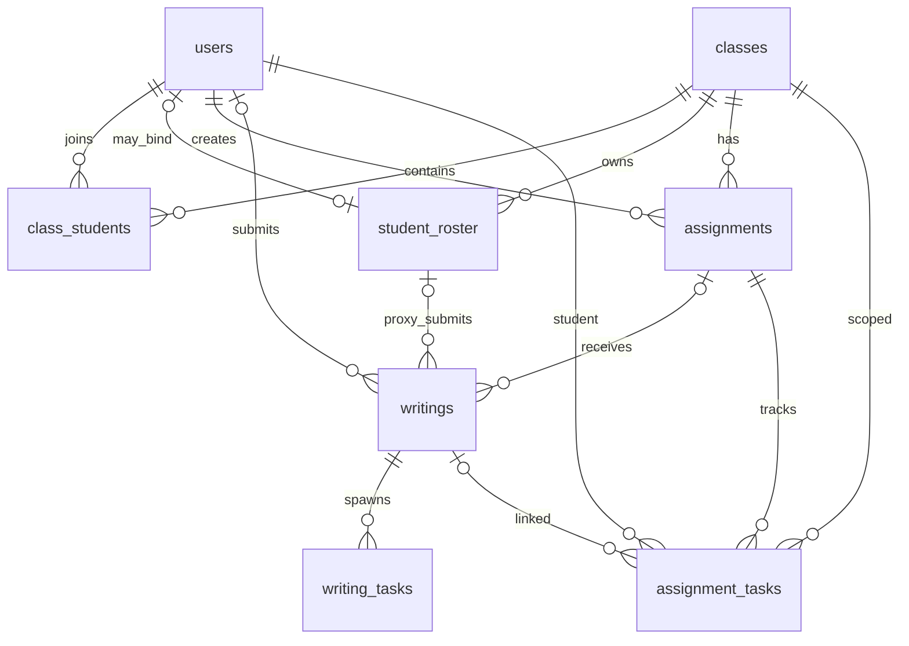

# DATA_MODEL

这份文档不是完整数据库字典，而是给接手者快速建立“核心表关系”的说明。

目标：

- 快速知道主要表之间怎么连
- 改需求时知道会影响哪些表
- 避免误改跨表流程

建议和下面文档一起阅读：

- [ARCHITECTURE.md](ARCHITECTURE.md)
- [SYSTEM_MAP.md](docs/SYSTEM_MAP.md)

## 1. 核心主线数据模型

## 2. 最重要的表

### 2.1 `users`

用途：

- 用户主表
- 教师 / 学生 / 管理员角色信息
- 班级归属信息

关键字段：

- `id`
- `account_code`
- `email`
- `phone`
- `role`
- `real_name`
- `student_no`
- `class_id`
- `class_name`
- `preferences`
- `is_admin`
- `is_disabled`
- `is_test_data`

常见关联：

- 和 `classes` 通过 `teacher_id`
- 和 `class_students` 通过 `student_id`
- 和 `writings` 通过 `user_id`
- 和 `assignment_tasks` 通过 `student_id`

### 2.2 `classes`

用途：

- 班级主表

关键字段：

- `id`
- `class_name`
- `class_code`
- `password`
- `teacher_id`
- `teacher_name`
- `is_test_data`

常见关联：

- 和 `users` 通过 `teacher_id`
- 和 `class_students`
- 和 `student_roster`
- 和 `assignments`

### 2.3 `class_students`

用途：

- 真实学生账号加入班级的关系表

关键字段：

- `class_id`
- `student_id`
- `joined_at`

说明：

- 这是“账号加入班级”的真实关系
- 不等于 `student_roster`

### 2.4 `student_roster`

用途：

- 教师维护的名单学生表
- 可以先有名单，再绑定真实账号

关键字段：

- `id`
- `class_id`
- `student_no`
- `student_name`
- `user_id`
- `status`

说明：

- `user_id` 可以为空
- 名单绑定/解绑是高风险流程
- 会影响 `writings` 和 `assignment_tasks`

### 2.5 `assignments`

用途：

- 作业主表

关键字段：

- `id`
- `class_id`
- `class_ids`
- `teacher_id`
- `title`
- `prompt_text`
- `status`
- `due_at`

说明：

- 一般和班级、教师、assignment task、writings 联动

### 2.6 `assignment_tasks`

用途：

- 作业对学生的执行/提交状态跟踪表

关键字段：

- `id`
- `assignment_id`
- `student_id`
- `class_id`
- `status`
- `writing_id`
- `latest_score`
- `submitted_at`
- `graded_at`

说明：

- 这是“作业面向学生的状态机”
- 名单绑定/解绑、作文提交都会影响它

### 2.7 `writings`

用途：

- 作文主表

关键字段：

- `id`
- `user_id`
- `roster_id`
- `assignment_id`
- `class_name`
- `writing_title`
- `selected_type`
- `feedback`
- `teacher_comment`
- `submitted_by_teacher`
- `is_test_data`

说明：

- 一个作文可能来自真实学生账号，也可能先挂在名单学生上
- 这也是班级绑定链路里最容易出错的表之一

### 2.8 `writing_tasks`

用途：

- AI 任务队列表

关键字段：

- `id`
- `writing_id`
- `task_type`
- `status`
- `created_at`

说明：

- 用于 grading / detailed_feedback / question_analysis 等任务

## 3. 管理后台相关表

### 3.1 `admin_budget_policies`

用途：

- AI 预算策略

### 3.2 `ai_usage_events`

用途：

- AI 使用事件埋点

### 3.3 `integration_accounts`

用途：

- 后台集成账号配置

### 3.4 `admin_operation_logs`

用途：

- 管理员操作日志

### 3.5 `system_settings`

用途：

- 系统设置键值表

## 4. 最脆弱的跨表流程

下面这些流程改动时，不能只看一个表。

### 4.1 学生加入班级

会影响：

- `class_students`
- `users`
- 可能影响 `student_roster`
- 可能影响 `writings`
- 可能影响 `assignment_tasks`

### 4.2 名单绑定 / 解绑

会影响：

- `student_roster`
- `users`
- `writings`
- `assignment_tasks`

这是目前最脆弱的链路之一。

### 4.3 删除班级 / 改班级名称

会影响：

- `classes`
- `users`
- `writings`
- `assignments`
- 可能影响 `student_roster`

### 4.4 作业发布 / 关闭 / 提交

会影响：

- `assignments`
- `assignment_tasks`
- `writings`

### 4.5 管理后台预算与统计

会影响：

- `admin_budget_policies`
- `ai_usage_events`
- `writing_tasks`
- `writings`
- `users`
- `classes`

## 5. 看表关系时的实用判断

如果你要改的是：

- 班级关系：先看 `classes + class_students + users`
- 名单逻辑：先看 `student_roster + users + writings + assignment_tasks`
- 作业链路：先看 `assignments + assignment_tasks + writings`
- AI 使用：先看 `writing_tasks + ai_usage_events`
- 管理后台：先看 `admin_* + integration_accounts + system_settings`

## 6. 修改数据库相关逻辑前的最低动作

1. 先看相关 service/domain/repository 分层
2. 确认会影响哪些表
3. 确认是否是高风险跨表流程
4. 先找现有测试
5. 没有测试就先补最小护栏

## 7. 当前建议后续补充

这份文档后续可以继续增加：

- 表字段级字典
- 主要索引说明
- 事务边界说明
- 关键状态机说明
- HTTP 接口到表的映射

