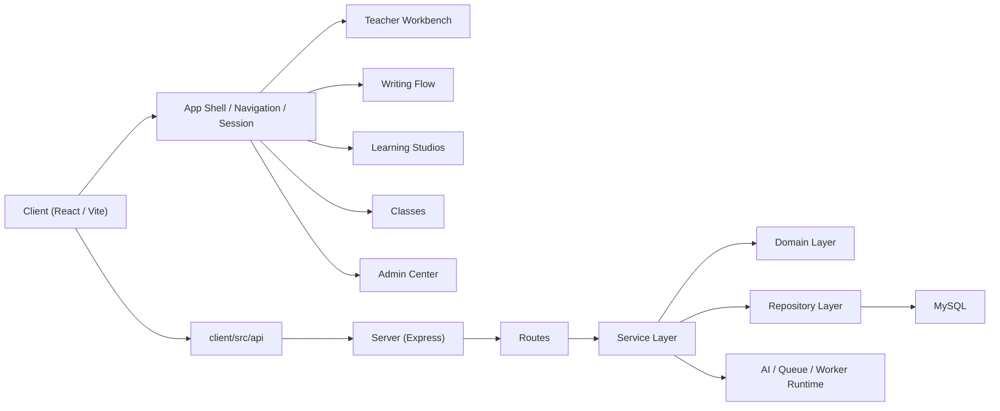

# SYSTEM_MAP

这份文档回答一个问题：

“这个系统现在由哪些模块组成，遇到某类问题应该先看哪里？”

适用对象：

- 新接手程序员
- 需要先建立模块心智模型的 AI

建议和下面文档一起阅读：

- [README.md](README.md)
- [ARCHITECTURE.md](ARCHITECTURE.md)
- [docs/engineering-roadmap.md](docs/engineering-roadmap.md)
- [docs/quality-baseline.md](docs/quality-baseline.md)
- 最新 `docs/handoffs/*.md`

## 1. 系统总览

## 2. 前端模块图

### 2.1 应用壳层

核心文件：

- `client/src/App.jsx`
- `client/src/app/useAppSession.jsx`
- `client/src/app/useAppNavigation.jsx`
- `client/src/app/useAppPageContext.jsx`
- `client/src/app/routes.js`
- `client/src/app/navigation.js`
- `client/src/app/pagePreloaders.js`

职责：

- `App.jsx`：应用装配
- `useAppSession`：登录态恢复、鉴权检查、用户恢复
- `useAppNavigation`：主页面切换和跳转上下文
- `useAppPageContext`：把当前页面需要的上下文装配出来
- `routes.js`：URL 与 page id 的双向映射
- `navigation.js`：角色可访问页面、默认页和旧 page id 归一化
- `pagePreloaders.js`：导航预加载入口，避免公开产品页懒加载闪烁

遇到这些问题先看这里：

- 登录后为什么跳到某个页面
- 页面刷新后为什么恢复到某个状态
- URL / 页面状态不一致
- 听力、词汇、语音等公开页面点击后为什么不显示
- 顶部导航 hover 后为什么没有预加载目标页面

### 2.2 公开学习产品页

核心目录：

- `client/src/writing/`
- `client/src/grammar/`
- `client/src/reading/`
- `client/src/phonetics/`
- `client/src/vocab/`
- `client/src/listening/`
- `client/src/speaking/`
- `client/src/pricing/` (subscription catalog data only; no standalone pricing page)

职责：

- 写作：写作首页、批改、题库练习、句子练习、写作建构、记录
- 语法：语法首页、长难句分析、课程、练习、题卷、进度
- 阅读：阅读首页、阅读分析、阅读练习、阅读题卷、课程、进度、阅读工作台
- 语音：语音首页、音素、音标、字母组合、音节、词语、句子朗读
- 词汇：词汇首页、阅读词汇、写作词汇、同义替换、闪卡、导入入口
- 听力：听力首页、基础听写、进阶精听、题卷练习
- 口语：题目练习、ASR 转写、即时反馈、进度记录
- 定价：会员 / 商业化入口页面

遇到这些问题先看这里：

- 某个公开页面空白或跳回默认页：先查 `routes.js`、`navigation.js`、`AppPageContent.jsx`、`GuestAppShell.jsx`
- 已登录后页面被窄容器包住：查 `AuthenticatedAppShell.jsx` 的 full-width 页面集合
- 产品主题色或 body class 不对：查 `siteTheme.js` 和页面根 class
- 页面懒加载失败或切换慢：查 `pagePreloaders.js` 是否注册

### 2.3 教师工作台

核心文件：

- `client/src/teacher/workbench/useTeacherWorkbenchModel.js`
- `client/src/teacher/workbench/useTeacherWorkbenchData.js`
- `client/src/teacher/workbench/useTeacherWorkbenchActions.js`
- `client/src/teacher/workbench/useTeacherWorkbenchDerivedState.js`
- `client/src/teacher/workbench/TeacherTodoScenePage.jsx`

职责：

- `useTeacherWorkbenchModel`：coordinator，只做装配
- `useTeacherWorkbenchData`：拉数据、恢复选中任务、默认班级与队列
- `useTeacherWorkbenchActions`：创建/发布/关闭/归档/导出/打开作文
- `useTeacherWorkbenchDerivedState`：筛选、自动聚焦、风险计数、偏好持久化

遇到这些问题先看这里：

- 工作台待办筛选不对
- 导出 / 发布 / 关闭行为异常
- 选中任务刷新后恢复不对

### 2.4 写作与反馈

核心目录：

- `client/src/writing/`
- `client/src/teacher/teacher-writing/`
- `client/src/components/FeedbackView/`

职责：

- 学生写作、提交、图片 OCR
- 教师作文详情
- AI 反馈与结构化展示

遇到这些问题先看这里：

- 学生提交作文失败
- OCR / 图片识别异常
- 教师点评页行为不对
- 反馈展示结构错乱

### 2.5 班级管理

核心目录：

- `client/src/teacher/classes/`

职责：

- 建班、找班、加班、班级列表、班级信息展示

### 2.6 管理后台

核心文件：

- `client/src/components/admin/AdminPage.jsx`
- `client/src/components/admin/useAdminPageModel.js`
- `client/src/components/admin/AdminLayout.jsx`
- 各个 `Admin*Panel.jsx`

职责：

- 后台页面装配
- 统计、预算、集成、日志、系统设置、公告、留言

遇到这些问题先看这里：

- 后台哪个面板显示错了
- tab 切换、后台总览、日志、设置的 UI/数据问题

## 3. 后端模块图

### 3.1 路由层

核心入口：

- `server/app.js`
- `server/routes/`

职责：

- 路由装配
- 参数进入
- 鉴权中转
- 错误交给统一中间件

### 3.2 认证与用户

核心文件：

- `server/services/authService.js`
- `server/services/authRepository.js`
- `server/services/userService.js`
- `server/services/userRepository.js`

### 3.3 班级

核心文件：

- `server/services/classService.js`
- `server/services/classDomain.js`
- `server/services/classRepository.js`
- `server/services/classCrudRepository.js`
- `server/services/classRosterRepository.js`
- `server/services/classJoinRepository.js`

职责：

- `classService`：班级流程编排
- `classDomain`：密码校验、名单错误翻译、学生统计
- `classCrudRepository`：班级 CRUD / 班级引用同步
- `classRosterRepository`：名单与班级成员查询
- `classJoinRepository`：加入班级、绑定/解绑名单、事务流程

遇到这些问题先看这里：

- 学生加入班级失败
- 名单导入、绑定、解绑异常
- 班级名称修改后引用不同步

### 3.4 作业与教师工作台

核心文件：

- `server/services/assignment*`
- `server/services/teacherWorkbench/queries.js`
- `server/services/assignmentSubmissionRowsService.js`

职责：

- 作业创建、发布、关闭、归档、任务状态
- 教师工作台查询
- 作业提交行和相关统计

### 3.5 写作与反馈

核心文件：

- `server/services/writingService.js`
- `server/services/writingSubmissionService.js`
- `server/services/writingAnalysisService.js`
- `server/services/feedback/`

### 3.6 管理后台

核心文件：

- `server/services/adminControlService.js`
- `server/services/adminControlDomain.js`
- `server/services/adminControlRepository.js`
- `server/services/adminStatsService.js`
- `server/services/adminStatsDomain.js`
- `server/services/adminStatsRepository.js`

职责：

- `adminControl*`：预算、设置、集成、日志
- `adminStats*`：dashboard、用户列表、用户详情、状态修改

### 3.7 批量批改与运行时

核心文件：

- `server/services/batchGradingService.js`
- `server/services/batchGradingRuntimeService.js`
- `server/workers/`

职责：

- 批量批改任务接口
- 恢复循环
- worker 运行时

## 4. 哪些模块最脆弱

### 高风险

- `server/services/classJoinRepository.js`
- `server/services/batchGradingRuntimeService.js`
- `client/src/teacher/workbench/*`

### 中高风险

- `server/services/classService.js`
- `server/services/adminControlRepository.js`
- `server/services/adminStatsRepository.js`

## 5. 常见需求应该先改哪里

### 登录 / 跳转 / 页面恢复

- 前端先看 `client/src/app/*`
- 后端先看 `authService / authRepository`

### 教师工作台待办

- 前端看 `workbench/data/actions/derived`
- 后端看 `teacherWorkbench/queries.js`

### 管理后台预算 / 设置 / 日志 / 集成

- 后端看 `adminControl*`
- 前端看 `client/src/components/admin/*`

### 班级加入 / 名单导入 / 绑定解绑

- 后端看 `classService + classDomain + classJoinRepository`
- 前端看 `client/src/teacher/classes/*`

### 作文提交 / OCR / 反馈

- 前端看 `client/src/components/writing/*`
- 后端看 `writingSubmissionService / writingAnalysisService / feedback`

## 6. 修改前默认顺序

1. 先确定改动属于哪个模块
2. 再确定属于哪一层：page/hook/service/domain/repository
3. 看这个模块现有测试在保护什么
4. 再开始写代码

如果还分不清，就不要直接开始改。
